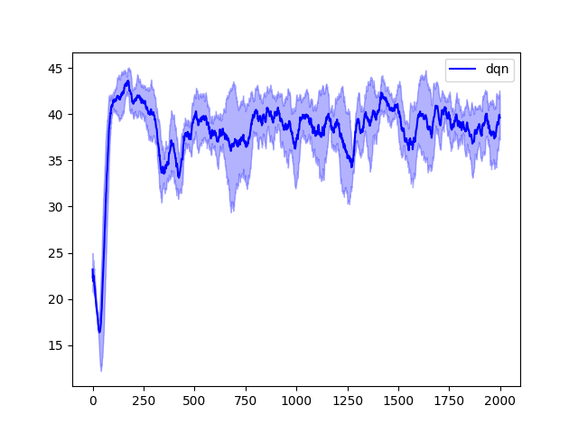
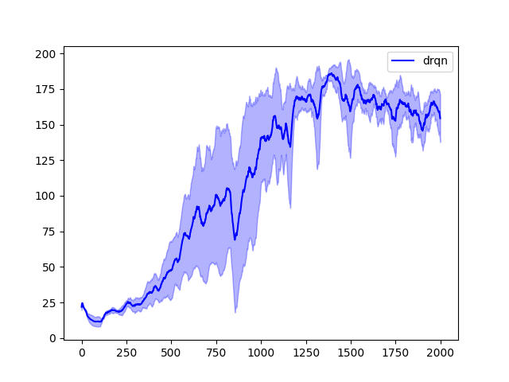
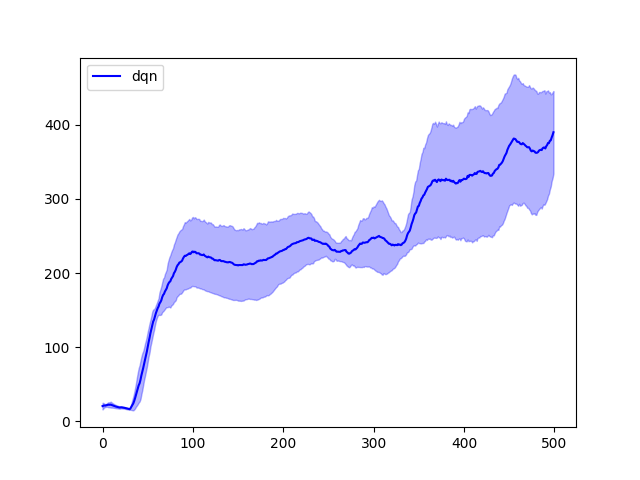
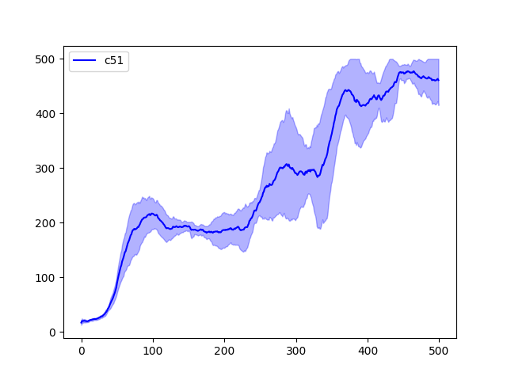

# CS885_Waterloo_RL Assignment 3
# Part I：Partially Observable RL

## 1. DRQN
> comparing DQN、DRQN on partially observable cartpole
  
  

### Explain  
在 partial observable cartpole 中，車輛速度與桿子角速度被從state中去除，使得DQN需要僅憑藉單一瞬間的車輛位置與桿子角度就推論出策略，但同樣車子位置與角度無法體現出的慣性，桿子是不是已經很快了不該再加速就可以保持平衡等等的潛在資訊會被消除，這樣的殘缺的狀態使DQN訓練不出有用的策略;反觀 DRQN利用LSTM，將一整段的序列料餵入，記憶了先前的狀態並重建了原先所缺少的部分，最終使DRQN可以學到有用的策略。

# Part II  
## 1. Distributional RL
> comparing DQN、C51 on noisy cartpole  

  
  

### Explain
noisy cartpole 中加入了摩擦力與隨機的托拽力量，使原先的deterministic env 轉變成了 stochastic env，在這種環境中，C51 所學習的對象是Q-value 的分布而非單一絕對值，這使C51能更好的建模並學習到環境中的機率分布，相較於MSE對離群值非常敏感，C51的分布投影+Cross Entropy方法讓更新的訊號更穩定，使得最終C51相較DQN有了更好更穩定的表現結果。
